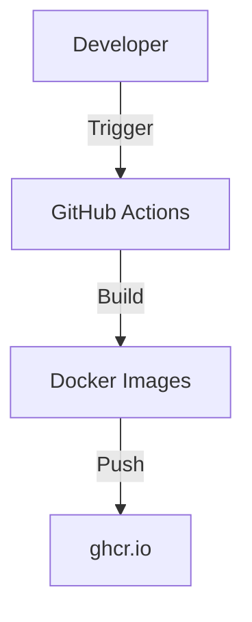

# Contributing to Research AI Agent

Thank you for your interest in contributing! This guide details how to set up your local development environment, understand the project structure, and work with our CI/CD pipeline.

## 🛠 Local Development Overview

### Prerequisites
- [Docker](https://docs.docker.com/get-docker/) & Docker Compose
- **Go 1.22+** (for Backend)
- **Node.js 20+** (for Frontend)
- **Python 3.12+** (for AI/LaTeX services)
- **Mistral AI API Key** (Get one [here](https://console.mistral.ai))

### Quick Start (Docker)

The easiest way to develop is using Docker Compose, which spins up all services with hot-reloading enabled.

1.  **Clone the repository**
    ```bash
    git clone https://github.com/Xeze-org/research_ai_agent.git
    cd research_ai_agent
    ```

2.  **Configure Environment**
    ```bash
    cp .env.example .env
    # Edit .env and add your MISTRAL_API_KEY
    # You can generate secure secrets using: openssl rand -base64 32
    ```

3.  **Start Services**
    ```bash
    docker compose -f docker-compose.dev.yml up --build
    ```

4.  **Access Application**
    - Frontend: http://localhost:5173
    - Backend API: http://localhost:8080
    - MinIO Console: http://localhost:9001

---

## 📂 Project Structure

```text
research_ai_agent/
├── frontend/                    # React + Vite + TypeScript
│   ├── src/
│   │   ├── components/          # UI components (shadcn/ui + custom)
│   │   ├── pages/               # Application pages
│   │   └── lib/                 # Utilities and API clients
│   └── Dockerfile.dev           # Development Dockerfile
│
├── backend/                     # Go REST API
│   ├── cmd/server/              # Main entrypoint
│   ├── internal/
│   │   ├── auth/                # Authentication logic
│   │   ├── research/            # Core business logic
│   │   └── store/               # Database interactions
│   └── go.mod
│
├── ai-service/                  # Python AI Service
│   ├── app/                     # FastAPI application
│   └── Dockerfile
│
├── latex-service/               # Python LaTeX Service
│   └── Dockerfile               # Includes TeX Live
│
├── .github/workflows/           # CI/CD Pipelines
└── docker-compose.dev.yml       # Dev orchestration
```

---

## 🏗 Architecture & Tech Stack

For a deep dive into the system design, please refer to our [**Wiki System Design Page**](https://github.com/Xeze-org/research_ai_agent/wiki/System_Design).

### Core Stack
- **Frontend**: React 19, TypeScript, TailwindCSS
- **Backend**: Go (Chi Router)
- **AI Service**: Python (FastAPI, Mistral AI)
- **Databases**: PostgreSQL (Auth), MongoDB (Docs), Redis (Sessions)
- **Storage**: MinIO (S3 Compatible)

---

## 🚀 deployment & CI/CD

We use GitHub Actions for continuous integration.

### Workflows
- **Build & Push**: Manually triggered workflows for each service.
- **Security Scan**: Weekly Trivy scans for vulnerabilities.

### Docker Images
All images are published to `ghcr.io/xeze-org/research-ai-agent-*`.



To create a new release, tag your commit or manually run the release workflow.
