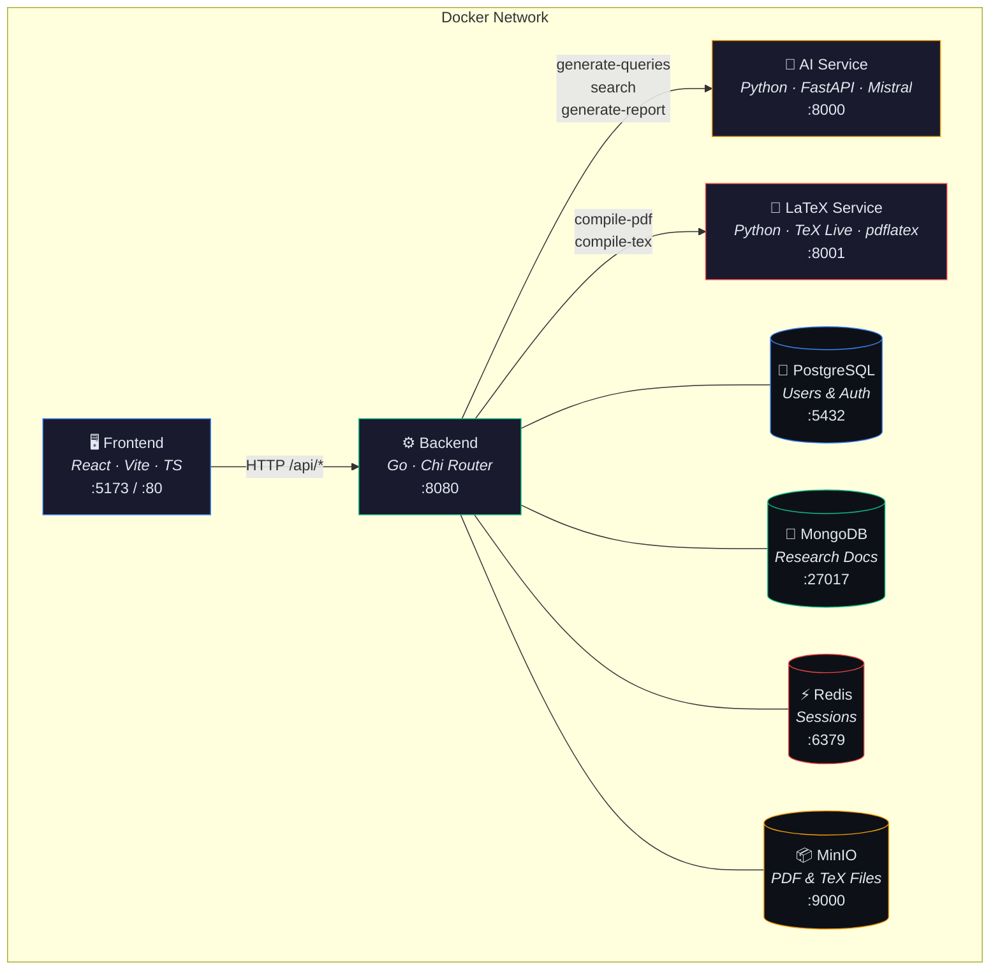
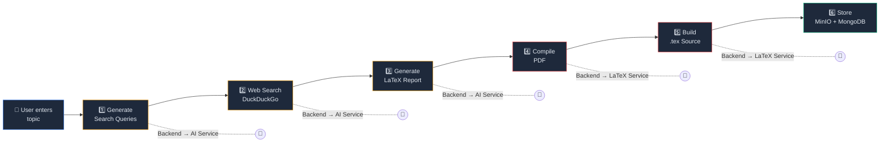
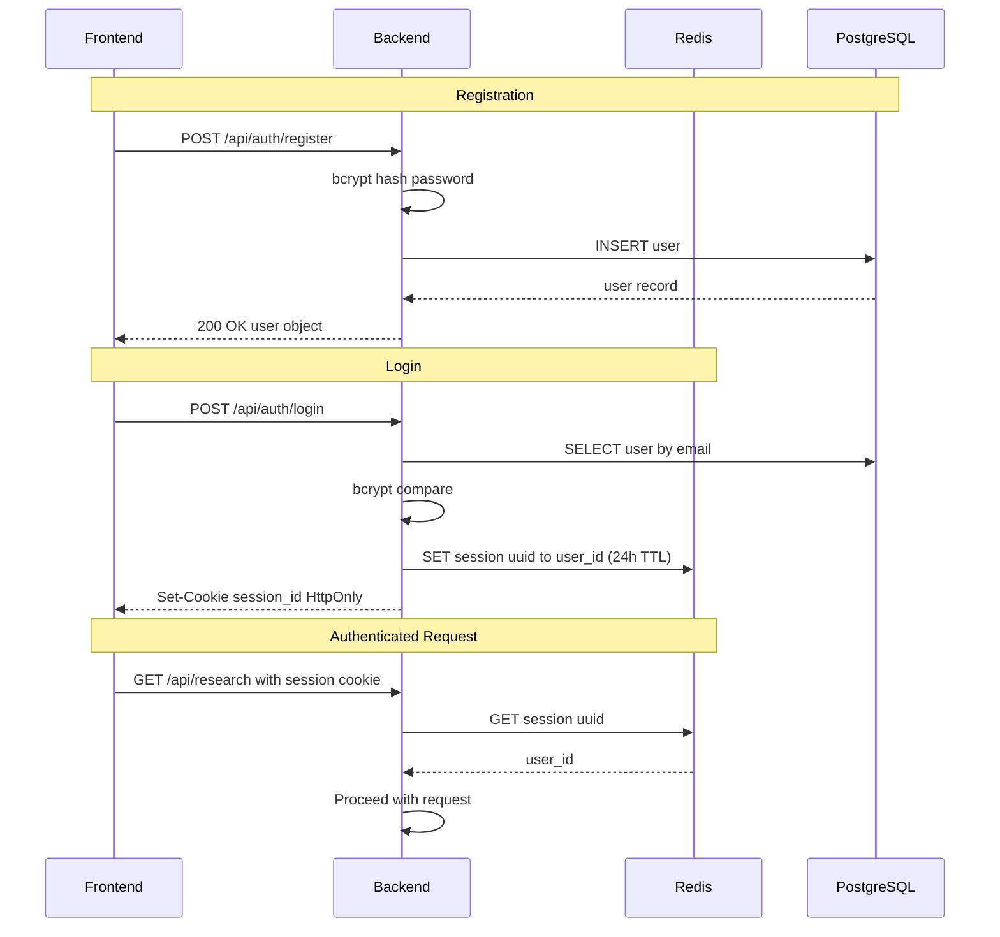
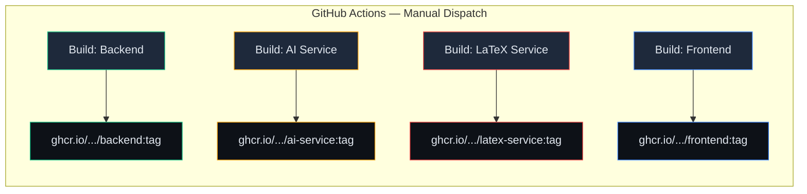
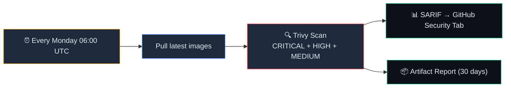

<p align="center">
  <h1 align="center">Research AI Agent</h1>
  <p align="center">
    AI-powered academic research report generator with LaTeX PDF output
    <br />
    <a href="https://github.com/Xeze-org/research_ai_agent">GitHub</a>
    ·
    <a href="#quick-start">Quick Start</a>
    ·
    <a href="#architecture">Architecture</a>
  </p>
</p>

---

A modular microservices platform that generates **publication-quality LaTeX research reports** from any topic. Enter a topic, and the system automatically searches the web, synthesizes sources, writes a full academic report in LaTeX, and compiles it to a downloadable PDF — all in under 3 minutes.

## Features

- **AI-Powered Research** — Generates search queries, scrapes the web, and writes comprehensive LaTeX reports using Mistral AI
- **Real LaTeX PDFs** — Compiled with `pdflatex` via TeX Live for professional typesetting (title page, table of contents, booktabs tables, hyperlinks, bibliography)
- **Session-Based Auth** — Secure user accounts with bcrypt passwords and Redis-backed sessions
- **Research History** — All reports stored in MongoDB with sidebar navigation
- **Download Options** — Export as PDF or raw `.tex` source
- **Configurable** — Choose AI model, research depth (Quick/Standard/Deep), and manage API keys from a dedicated settings page
- **True Black UI** — Modern React frontend with shadcn/ui, Tailwind CSS, and a true-black dark theme
- **Dockerized** — Full Docker Compose setup for both development and production
- **CI/CD** — Per-service GitHub Actions builds + weekly Trivy security scans

---

## Architecture

### Service Map



### Services

| Service | Technology | Port | Purpose |
|---------|-----------|------|---------|
| **Frontend** | React 19, Vite 6, TypeScript, shadcn/ui, Tailwind CSS 4 | `5173` / `80` | User interface |
| **Backend** | Go 1.22+, Chi router, pgx, mongo-driver | `8080` | REST API, auth, orchestration |
| **AI Service** | Python 3.12, FastAPI, Mistral AI, DuckDuckGo Search | `8000` | Query generation, web search, report writing |
| **LaTeX Service** | Python 3.12, FastAPI, TeX Live, pdflatex | `8001` | LaTeX compilation to PDF and `.tex` |
| **PostgreSQL 16** | — | `5432` | User accounts and authentication |
| **MongoDB 7** | — | `27017` | Research documents and metadata |
| **Redis 7** | — | `6379` | Session storage and caching |
| **MinIO** | — | `9000` | PDF and `.tex` file object storage |

### Research Pipeline



### Authentication Flow



---

## Quick Start

### Prerequisites

- [Docker](https://docs.docker.com/get-docker/) and Docker Compose
- A [Mistral AI API key](https://console.mistral.ai) (entered in the app's Settings page)

### Development

```bash
# 1. Clone
git clone https://github.com/Xeze-org/research_ai_agent.git
cd research_ai_agent

# 2. Configure environment
cp .env.example .env
# Edit .env and set strong passwords (or use the generated ones)

# 3. Build and start all services
docker compose -f docker-compose.dev.yml up --build

# 4. Open the app
# → http://localhost:5173
```

### Production

```bash
# Pull pre-built images and start
cp .env.example .env
# Edit .env with production passwords
VERSION=latest docker compose up -d

# → http://localhost (port 80)
```

### First Use

1. Open the app and **Register** a new account
2. Go to **Settings** (gear icon) and enter your **Mistral AI API key**
3. Return to the Dashboard, enter a research topic, and click **Start Research**
4. Wait ~2 minutes for the AI to research, write, and compile your report
5. View the report inline, or download as **PDF** or **.tex**

---

## Environment Variables

All credentials are centralized in a single `.env` file used by both Docker Compose configurations.

| Variable | Description | Example |
|----------|-------------|---------|
| `VERSION` | Docker image tag (production) | `latest` |
| `POSTGRES_USER` | PostgreSQL username | `postgres` |
| `POSTGRES_PASSWORD` | PostgreSQL password | `<random>` |
| `POSTGRES_DB` | PostgreSQL database name | `research` |
| `MONGO_INITDB_ROOT_USERNAME` | MongoDB admin username | `mongoadmin` |
| `MONGO_INITDB_ROOT_PASSWORD` | MongoDB admin password | `<random>` |
| `MONGO_DB` | MongoDB database name | `research_agent` |
| `REDIS_PASSWORD` | Redis password | `<random>` |
| `MINIO_ACCESS_KEY` | MinIO access key | `<random>` |
| `MINIO_SECRET_KEY` | MinIO secret key | `<random>` |
| `MINIO_BUCKET` | MinIO bucket for files | `research-pdfs` |
| `SESSION_SECRET` | HMAC key for session signing | `<random>` |
| `FRONTEND_PORT` | Public frontend port | `80` |
| `BACKEND_PORT` | Public backend port | `8080` |
| `AI_SERVICE_PORT` | Public AI service port | `8000` |
| `LATEX_SERVICE_PORT` | Public LaTeX service port | `8001` |

---

## API Reference

### Authentication

| Method | Endpoint | Description | Auth |
|--------|----------|-------------|------|
| `POST` | `/api/auth/register` | Create account | No |
| `POST` | `/api/auth/login` | Sign in (sets `session_id` cookie) | No |
| `POST` | `/api/auth/logout` | Sign out | Yes |
| `GET` | `/api/auth/me` | Get current user | Yes |

### Research

| Method | Endpoint | Description | Auth |
|--------|----------|-------------|------|
| `POST` | `/api/research/` | Create new research report | Yes |
| `GET` | `/api/research/` | List all user's research | Yes |
| `GET` | `/api/research/:id` | Get single research | Yes |
| `DELETE` | `/api/research/:id` | Delete research + files | Yes |
| `GET` | `/api/research/:id/pdf` | Download compiled PDF | Yes |
| `GET` | `/api/research/:id/tex` | Download `.tex` source | Yes |

### AI Service (internal)

| Method | Endpoint | Description |
|--------|----------|-------------|
| `GET` | `/health` | Health check |
| `POST` | `/api/generate-queries` | Generate search queries from topic |
| `POST` | `/api/search` | Web search via DuckDuckGo |
| `POST` | `/api/generate-report` | Generate LaTeX report body |

### LaTeX Service (internal)

| Method | Endpoint | Description |
|--------|----------|-------------|
| `GET` | `/health` | Health check |
| `POST` | `/api/compile-pdf` | Compile LaTeX to PDF via pdflatex |
| `POST` | `/api/compile-tex` | Build full `.tex` document |

---

## Project Structure

```
research_ai_agent/
├── frontend/                    # React + Vite + TypeScript
│   ├── src/
│   │   ├── components/          # UI components (shadcn/ui + custom)
│   │   │   ├── ui/              # shadcn/ui primitives
│   │   │   └── research/        # ReportView, SourcesList
│   │   ├── hooks/               # useAuth, useResearch
│   │   ├── lib/                 # API client, utilities
│   │   ├── pages/               # Login, Register, Dashboard, Report, Settings
│   │   ├── types/               # TypeScript interfaces
│   │   ├── App.tsx              # Router
│   │   └── index.css            # True-black theme
│   ├── Dockerfile               # Production (multi-stage → nginx)
│   └── Dockerfile.dev           # Development (Vite dev server)
│
├── backend/                     # Go REST API
│   ├── cmd/server/main.go       # Entrypoint, wiring
│   ├── internal/
│   │   ├── auth/                # Register, Login, Logout, Sessions
│   │   ├── config/              # Environment variable loading
│   │   ├── middleware/          # Auth middleware
│   │   ├── models/              # User, Document, Source structs
│   │   ├── research/            # Handler, AIClient, LaTeXClient
│   │   └── store/               # PostgreSQL, MongoDB, Redis, MinIO
│   ├── go.mod
│   └── Dockerfile               # Multi-stage Go build
│
├── ai-service/                  # Python AI service (~200MB image)
│   ├── app/
│   │   ├── main.py              # FastAPI endpoints
│   │   ├── ai.py                # Mistral AI query/report generation
│   │   ├── search.py            # DuckDuckGo web search
│   │   ├── latex.py             # clean_latex_body() post-processor
│   │   └── schemas.py           # Pydantic models
│   ├── requirements.txt
│   └── Dockerfile               # python:3.12-slim (no TeX Live)
│
├── latex-service/               # LaTeX compilation service (~2GB image)
│   ├── app/
│   │   ├── main.py              # FastAPI endpoints
│   │   ├── latex.py             # pdflatex compilation + document builder
│   │   └── schemas.py           # Pydantic models
│   ├── requirements.txt
│   └── Dockerfile               # python:3.12-slim + TeX Live + lmodern
│
├── .github/
│   ├── dependabot.yml           # Automated dependency updates
│   └── workflows/
│       ├── build-backend.yml    # Manual: build & push backend
│       ├── build-ai-service.yml # Manual: build & push AI service
│       ├── build-latex-service.yml # Manual: build & push LaTeX service
│       ├── build-frontend.yml   # Manual: build & push frontend
│       └── security-scan.yml    # Weekly: Trivy image scan
│
├── docker-compose.yml           # Production (pre-built ghcr.io images)
├── docker-compose.dev.yml       # Development (builds from source)
├── .env.example                 # Environment variable template
└── README.md
```

---

## Docker Images

All images are published to **GitHub Container Registry** on each build:

| Service | Image | Size |
|---------|-------|------|
| Backend | `ghcr.io/xeze-org/research-ai-agent-backend` | ~20 MB |
| AI Service | `ghcr.io/xeze-org/research-ai-agent-ai-service` | ~200 MB |
| LaTeX Service | `ghcr.io/xeze-org/research-ai-agent-latex-service` | ~2 GB |
| Frontend | `ghcr.io/xeze-org/research-ai-agent-frontend` | ~25 MB |

```bash
# Pull a specific version
docker pull ghcr.io/xeze-org/research-ai-agent-backend:1.0.0
docker pull ghcr.io/xeze-org/research-ai-agent-ai-service:1.0.0
docker pull ghcr.io/xeze-org/research-ai-agent-latex-service:1.0.0
docker pull ghcr.io/xeze-org/research-ai-agent-frontend:1.0.0
```

---

## CI/CD

### Manual Builds (per service)

Each service has its **own workflow** — build only what changed:



1. Go to **Actions** → pick the service workflow
2. Click **Run workflow** → enter a version tag (e.g. `1.1.0`)
3. Image is built, tagged, and pushed to ghcr.io

### Weekly Security Scan



### Dependabot

Automated dependency PRs are enabled for all ecosystems:
- **npm** (frontend) · **gomod** (backend) · **pip** (ai-service, latex-service)
- **Docker** base images · **GitHub Actions** versions

---

## Local Development (without Docker)

### Backend (Go)

```bash
cd backend
go mod tidy
# Set required env vars (POSTGRES_DSN, MONGO_URI, etc.)
go run ./cmd/server
```

### AI Service (Python)

```bash
cd ai-service
python -m venv venv && source venv/bin/activate  # or venv\Scripts\activate on Windows
pip install -r requirements.txt
uvicorn app.main:app --reload --port 8000
```

### LaTeX Service (Python)

```bash
cd latex-service
# Requires TeX Live installed locally: sudo apt install texlive-full
python -m venv venv && source venv/bin/activate
pip install -r requirements.txt
uvicorn app.main:app --reload --port 8001
```

### Frontend (React)

```bash
cd frontend
npm install
npm run dev
# → http://localhost:5173
```

---

## Tech Stack

| Layer | Technology |
|-------|-----------|
| Frontend | React 19, Vite 6, TypeScript 5, shadcn/ui, Tailwind CSS 4, React Router 7, KaTeX |
| Backend | Go 1.22+, Chi router, pgx (PostgreSQL), mongo-driver, go-redis, minio-go |
| AI Service | Python 3.12, FastAPI, Mistral AI SDK, DuckDuckGo Search, Tenacity |
| LaTeX Service | Python 3.12, FastAPI, TeX Live (pdflatex) |
| Auth | Session-based (Redis), bcrypt password hashing, HttpOnly cookies |
| Databases | PostgreSQL 16 (users), MongoDB 7 (research), Redis 7 (sessions) |
| Storage | MinIO (S3-compatible object storage for PDFs and .tex files) |
| CI/CD | GitHub Actions, Trivy, Dependabot, GitHub Container Registry (ghcr.io) |
| Containers | Docker, Docker Compose |

---

## License

MIT
